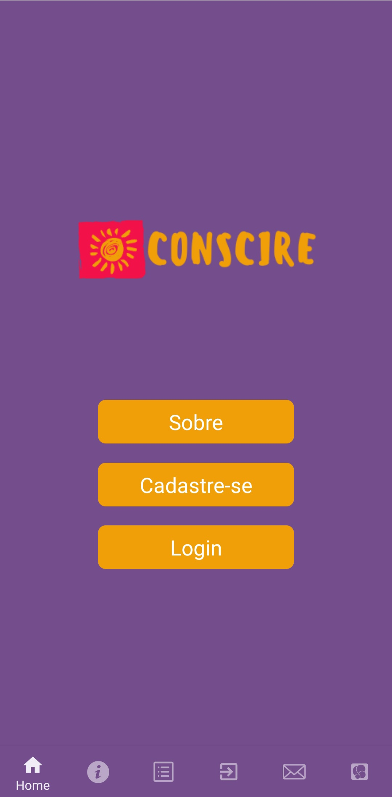
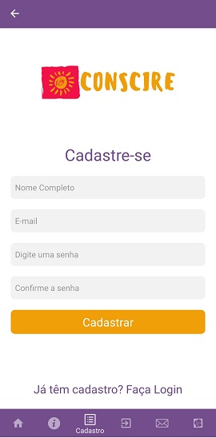
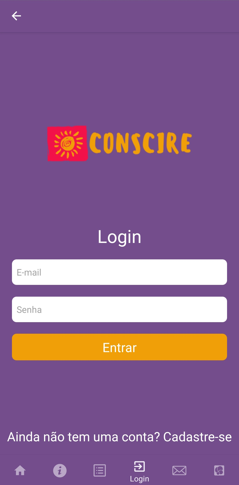
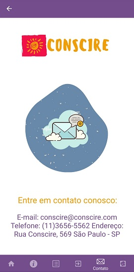

Mobile - Projeto Conscire

O Projeto Conscire visa educar e conscientizar os jovens, de 15 a 18 anos em situação de vulnerabilidade social, a respeito das consequências do álcool. Por meio de uma plataforma simples e amigável, queremos instigar maior pensamento crítico, através de materiais e quizes sobre o tema, como ferramenta de conscientização.

